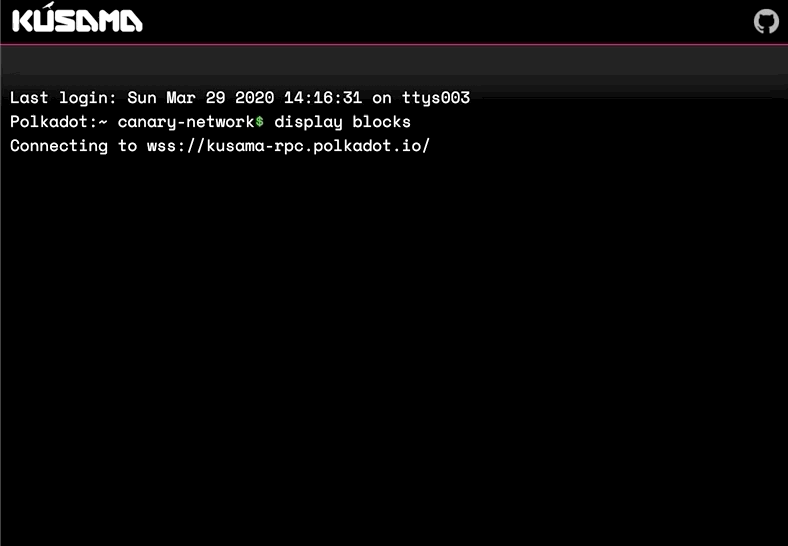

# Kusama Terminal

A live block feed from Polkadots canary network, Kusama.

###### [Live Site](https://emostov.github.io/kusama-terminal/dist/)



## Table of Contents

* [Background](#background)
* [Technologies](#technologies)
* [Technical Highlights](#technical-highligths)

---

## Background

###### [Jump to Technologies](#technologies)

The aim of this project was to learn about Polkadot, Substrate, and the role of Kusama in devloping Polkadot. I find Polkadot exciting because its approach to chain interopability seems to have potential for broadening the practical use of blockchain, and reducing bounds of scalability found in other projects.

My journey for this project brought me to participate in Parities Riot chat rooms, read through depths of Parities and Web3foundations documentation, and scour the quickly evolving codebases of Substrate (Rust) and Polkadot.js (TypeScript). While not reflected directly in the scripts for this project, I was able to significantly further my understanding of Polkadot's NPoS protocol and their various solutions on chain interopability.

Much of the challenges from this project where due to the quickly evolving nature of Polkadot's ecosystem, the resulting gaps in documentation, and just minimal resources in general compared to the ecosystems surrounding more matured protocols. This made it a good oppurtunity for me to work on my skills of reading through GitHub codebases.

The publically tangible result of my research is this quick project. I eschewed any frontend frameworks, and instead decided to keep it as simple as possible. The idea is to provide a very simple and aestheticaly appealing interface that gives a pulse about the state of the newest blocks.

The block feed mimics the appearance of a modern Mac terminal, updates upon succesful connection to Kussama, and subsequently updates the block feed as new blocks come in. The feed displays essential information, with things such as block author and timestamp, which are not trivial to extract. Some fields, such as block author, link to the relevant page on Polkascan so the user can get more info if desired.

At the time of writing Polkadot has yet to go public with their mainnet.

---

## Technologies

###### [Jump to Technical Highlights](#technical-highlights)

* Kusama
* Polkadotjs
* Vanila Javascript
* Webpack

---

## Technical Highlights

### Getting timestamp

In Polkadot, the block is currently divided into two main parts, Header and Extrinsics. Extrinsics represent any information that is external to the blockchain. Because of the generalizablity of Polkadot, this means more then just signed transactions. There are three types of exrinsics: signed transactions (analogous to transaction in Bitcoin, Ethereum etc.), unsigned transactions (used for a few specific use cases, such as creating an account, where there cannot be a key holder), and inherents.

For further refference on intrinsics consult [this page](https://substrate.dev/docs/en/next/conceptual/node/extrinsics) from substrate.dev.

Inherents are added to the block by the author, and are simply accepted as true as long as they seem reasonable. They are not part of the normal transaction pool and are not gossiped. Instead they are just data points for a limited set of potential fields. The three most common inherents I encountered while looking through blocks for this project where ```set``` for time, ```final_hint``` for giving a hint of the best finalized block, and ```set_heads``` which includes canidate reciepts for parachain blocks (essentially minimized proofs of validity).

```javascript


function getTimeInSeconds(block) {

  // Loop through the blocks extrinsics
  const timeEx = block.extrinsics.find(

    // Check the call index to see if it is the "set" call, which indicates it
    // is an inherent for a timestamp given by the block author.
    // The call is represented by a hex number, however in this case, in order
    // to get consistent conversion I convert the hex number (which comes
    // across as an array) to a string and compare it to the string "2,0", which
    // is simply what that underlying array converts over to in vanilla js.
    (ex) => ex.callIndex.toString() === '2,0',
  );

  const intTime = parseInt(timeEx.args.toString(), 10);

   // Convert to seconds and round off decimals
  return Math.floor(intTime / 1000);
}

```

### Getting Block Author

```javascript

function findAuthor(header, validators) {
  // Find the first log w
  const entity = header.digest.logs.find((log) => log.isPreRuntime);
  const [engine, data] = entity.asPreRuntime;
  const author = engine.extractAuthor(data, validators);
  return author.toString();
}

```